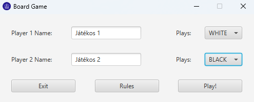
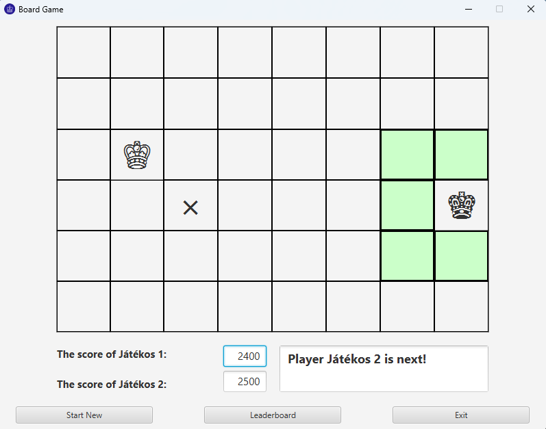
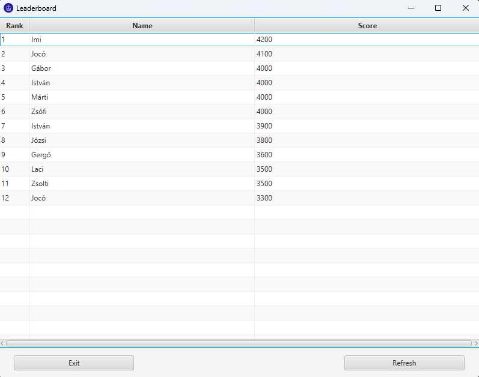

<h1 style="text-align: center;">Homework Project (Game #2.26)</h1>

In this game, there are two kings on a board.

The rules are simple:

    <li>The player with the White King starts, and after each step,
        the player deletes a tile.</li>
    <li>A player wins the game, if the other player can't move anymore.</li>

<h3>The game consists of three main scenes.</h3>

The first is the start scene, where the
players can give their names, and choose their color.

    

On the second and main scene, you can see the board, where the players can move
their pieces, and delete tiles until one of them can't move anymore.

    

And on the third scene, you can check the leaderboard. There is also a refresh
button, so it can be kept open while playing, and refresh it after someone wins.

    

Additionally, you can check the documentation made with Javadoc if you click
<a href="https://shrek.unideb.hu/~p.kristof1999/homework-project-pkristof1999/">HERE</a>!
